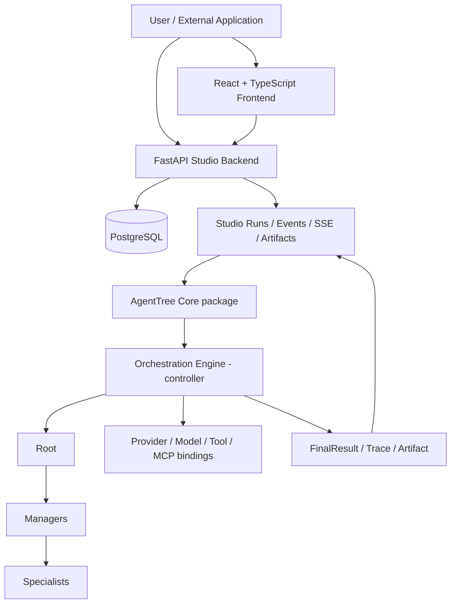

# AgentTree Studio

AgentTree Studio คือ Web Application สำหรับออกแบบ ตั้งค่า ทดสอบ ตรวจสอบ และเชื่อมต่อ Multi-Agent Tree ที่ทำงานด้วย [AgentTree Core](https://github.com/FlukeNoppanan/Agenttree) โดยมี Visual Builder, Guided Wizard และ Playground อยู่ใน workflow เดียวกัน

**Application version: 0.1.0** · โครงการปริญญานิพนธ์ระดับปริญญาตรี / research prototype

## ภาพรวม

Tree กำหนดว่า Agent แต่ละตัวมีบทบาทอะไร เหมาะกับงานประเภทใด และใช้ Model หรือ Tool ใด ไม่ได้เป็น workflow ที่ลาก Node ชนิดใดมาต่อกันก็ได้:

- **Root** ประสานงานระดับ Tree และตรวจผลลัพธ์สุดท้าย
- **Manager** แบ่งงาน มอบหมายให้ Specialist ตรวจผล และขอแก้ไขตามขอบเขตที่กำหนด
- **Specialist** ทำงานเฉพาะด้านตาม Capability, Model และ Tools ที่ได้รับ

Orchestration Engine เป็น runtime/controller ที่ควบคุมการทำงาน ไม่ใช่ AI Agent อีกตัวหนึ่ง Studio เก็บ configuration และ Execution ส่วน Core เป็น framework package แยก repository

## ความสามารถหลัก

| ส่วน | สิ่งที่ใช้งานได้ |
| --- | --- |
| Build | Visual Builder พร้อม drag/drop, hierarchy connections, shared Tool/MCP nodes, Inspector, Undo/Redo และ Auto Layout; Guided Wizard ใช้ Tree model เดียวกัน |
| Configure | Provider/Model แยกตาม Agent, Capability, Instructions, Tools และ backend-authoritative readiness |
| Templates | เริ่มจาก Template หรือ Blank Tree และบันทึก Tree เป็น Template ตามกติกาการตัด environment bindings ที่มีอยู่ |
| Providers | การเชื่อมต่อ Provider, model discovery และ qualification เพื่อแยก Model ที่พบออกจาก Model ที่ใช้งานกับ AgentTree ได้ |
| Tools / MCP | HTTP Tools, MCP stdio / Streamable HTTP และ Artifact Output; Tools เป็นทรัพยากร ไม่ใช่ Agent |
| Test | Playground สร้าง Run จริง แต่ละ input เป็น Run อิสระ ไม่มี conversation memory |
| Inspect | Executions, Live View, durable events, Execution Trace, final result, Artifacts และ cancellation |
| Connect | Public API V1/V2, Incoming Webhook และ outgoing Result Destination |
| Access | Sessions, Users, permissions, Tree grants แบบ selected/all, API Keys และ Security Events |
| UX | Getting Started, Welcome พร้อม temporary snooze, Light/Dark และ English/Thai |

## สถาปัตยกรรม



Frontend ใช้ `/api` proxy ไปยัง backend ใน Docker network ส่วน URL ที่ผู้ใช้เรียกใช้เป็น URL ของ deployment ไม่ใช่ชื่อ container ภายใน PostgreSQL เก็บข้อมูล Studio; Artifact bodies อยู่ใน persistent storage ของ backend

## Workflow การใช้งาน

1. เข้าสู่ระบบ เปิด **Getting Started** จาก top bar เมื่อต้องการคำแนะนำ
2. เชื่อมต่อ **AI Provider** และเลือก Model ที่ผ่าน qualification
3. กด **Create Tree** แล้วเลือก **Visual Builder** หรือ **Guided Wizard**; ใช้ Template หรือ Blank Tree ตามงาน
4. ตั้งค่า Root, Manager และ Specialist ให้ครบ ตรวจ issues จน Tree พร้อมใช้งาน
5. เปิด **Playground** ใส่ input จริงเพื่อทดสอบ Tree
6. ดู Result และเปิด **Execution Trace** ของ Run เดียวกันเพื่อตรวจการมอบหมายงาน การ review และการใช้ Tools
7. เปิด **Connect** เมื่อต้องการนำ Tree ไปใช้ผ่าน API หรือ Webhook

Tree ที่สร้างด้วย Wizard เปิดแก้ใน Builder ได้ และทั้งสองแบบใช้ runtime เดียวกับ API

## การติดตั้งและใช้งาน

ต้องมี Git, Docker และ Docker Compose รุ่นที่รองรับ `build.additional_contexts` วาง repository ทั้งสองไว้ข้างกัน เนื่องจาก backend Docker build ติดตั้ง Core จาก `../Agenttree`:

```bash
git clone https://github.com/FlukeNoppanan/Agenttree.git
git clone https://github.com/FlukeNoppanan/agenttree-studio.git Agenttree-Studio
git -C Agenttree switch --detach thesis-baseline-v0.1
cd Agenttree-Studio
cp .env.example .env
docker compose up -d --build
docker compose ps
```

ใช้ `cp` สำหรับการติดตั้งใหม่เท่านั้น อย่าเขียนทับ `.env` เดิม ตั้งค่า password ใน `.env` ก่อนเปิดให้เครือข่ายอื่นเข้าใช้งาน Bootstrap Admin ใช้เฉพาะ database ใหม่และไม่เปลี่ยน password ของ User ที่มีอยู่แล้ว

- Studio: [http://localhost:5173](http://localhost:5173)
- Backend API documentation: [http://localhost:8000/docs](http://localhost:8000/docs)
- PostgreSQL อยู่ภายใน Compose network

สำรอง PostgreSQL volume, `studio_key` volume และ `workspace` ร่วมกัน เพราะ encryption key และ Artifact bodies ต้องอยู่คู่กับ database อย่าใช้ `docker compose down -v` หากต้องการเก็บข้อมูลเดิม

ดูรายละเอียดเพิ่มเติมใน [Getting Started](docs/getting-started.md) และ [Core runtime integration](docs/core-runtime-integration.md)

### ตรวจสอบ local development

เมื่อมี Python virtual environment ที่ติดตั้ง [requirements.txt](requirements.txt) แล้ว:

```bash
.venv/bin/python -m pytest -q
cd frontend
npm ci
npm test
npx tsc -b
npm run build
```

Docker ใช้ PostgreSQL; direct backend development ใช้ SQLite เป็นค่าเริ่มต้นเมื่อไม่ได้กำหนด database URL จึงควรตรวจ environment ให้ตรงกับงานที่กำลังทดสอบ

## Environment

ดูค่าเริ่มต้นและคำอธิบายใน [.env.example](.env.example) ตารางนี้แสดงเฉพาะชื่อ ไม่ใช่ credentials:

| ตัวแปร | ใช้สำหรับ |
| --- | --- |
| `POSTGRES_DB`, `POSTGRES_USER`, `POSTGRES_PASSWORD` | PostgreSQL ใน Compose |
| `FRONTEND_PORT`, `BACKEND_PORT` | Host ports |
| `AGENTTREE_STUDIO_DATABASE_URL` | Direct backend development; Compose ประกอบ URL จาก `POSTGRES_*` |
| `AGENTTREE_STUDIO_ENCRYPTION_KEY` | Fernet key; หากว่างใน Docker จะสร้างและเก็บใน volume |
| `AGENTTREE_STUDIO_ADMIN_USERNAME`, `AGENTTREE_STUDIO_ADMIN_PASSWORD` | Bootstrap Admin ของ database ใหม่ |
| `AGENTTREE_STUDIO_SECURE_COOKIES` | Cookie สำหรับ deployment ที่ใช้ HTTPS |
| `AGENTTREE_PUBLIC_API_CORS_ORIGINS` | Browser origins ที่อนุญาตให้เรียก Bearer Public API |
| `AGENTTREE_STUDIO_PUBLIC_ORIGIN` | Public origin สำหรับ Connect examples และ Webhook URLs |
| `AGENTTREE_STUDIO_ARTIFACT_ROOT`, `AGENTTREE_STUDIO_MAX_ARTIFACT_BYTES` | Artifact storage/size configuration ของ backend; ตรวจ Compose สำหรับค่าที่ส่งเข้า container |

## Provider ที่รองรับ

Studio มี adapter สำหรับ **OpenAI, Gemini, Ollama, Groq, OpenRouter, Cerebras และ OpenAI-compatible endpoints** การพบชื่อ Model ไม่ได้แปลว่า Model นั้นรองรับ structured decisions หรือ Tools ที่ Tree ต้องใช้ ต้องตรวจ qualification และ readiness ก่อน Run

Credentials อ้างอิงผ่าน Secrets ที่เข้ารหัส ไม่ควรใส่ค่า Secret ลงใน Tree JSON, README หรือภาพหน้าจอ

## API และ Integration

- **[Public API V2](docs/public-api-v2.md)**: ตัวเลือกหลักสำหรับ integration แบบ background Run พร้อม status, SSE/replay, result, cancellation และ Artifacts
- **[Public API V1](docs/public-api-v1.md)**: synchronous Tree invocation สำหรับการใช้งานที่ต้องการคำตอบใน request เดียว
- **Incoming Webhook**: authenticated ingress สร้าง Run ผ่าน infrastructure เดิม ตรวจสถานะเจ้าของและสิทธิ์ Tree ไม่ใช่ Result Destination
- **Result Destination**: ส่งผลลัพธ์ออกเมื่อ Run เสร็จตาม configuration ที่มีอยู่ ไม่ใช่ Tool ของ Agent

จัดการ API Keys จาก **Account → API Keys** ค่า raw key แสดงครั้งเดียว ระบบเก็บ hash และผูกสิทธิ์กับ User ปัจจุบัน การอนุญาตให้เรียก Tree ยังขึ้นกับ action permissions และ Tree grants

## Thesis Baseline

- Application version: **0.1.0**
- Historical functional baseline: **`thesis-baseline-v0.1`** — `6438d29e96c8fdff577bc5858e5c23ca090705a2`
- UI/documentation revision: ดูสถานะ tag **`thesis-baseline-v0.1.1`** และ SHA ที่ยืนยันแล้วใน [revision manifest](docs/thesis-baseline-v0.1.1.md)
- Core frozen runtime: **`thesis-baseline-v0.1`** — `f01856b99a079c01e00c60988d3657819c95a188`

v0.1.1 เป็นงาน UI/documentation บน functional baseline เดิม ไม่ได้เปลี่ยน orchestration, Public API หรือ database schema ส่วน Core branch อาจมี README commit ใหม่กว่า frozen runtime tag

ดู [historical verification](docs/verification-thesis-baseline-v0.1/report.md) และ [post-freeze verification](docs/verification-post-freeze-ui-polish/report.md)

## สถานะโครงการและกรณีศึกษา

โครงการนี้เป็น research prototype สำหรับปริญญานิพนธ์ ไม่ได้อ้างว่าเป็น enterprise production-ready platform กรณีศึกษาต่อไปนี้ **อยู่ในแผน ยังไม่ได้เริ่มใน revision นี้**:

1. Wazuh → AgentTree → Discord
2. Network Configuration
3. Software Development

## ข้อจำกัด

- Execution ที่กำลังทำงานอยู่ผูกกับ process ของ backend; browser reload reattach ได้ผ่าน persisted Run แต่ backend restart ไม่ใช่การรับประกัน recovery ของ active work และ Studio ทำเครื่องหมาย Run ที่กู้คืนไม่ได้เป็น failed
- Canvas coordinates/preferences บางส่วนอยู่ใน browser-local storage ไม่ได้เป็น shared layout ใน database
- ความสามารถและ quota ของ Provider/Model แตกต่างกัน ไม่มีการรับประกันว่า Model ทุกตัวใช้ได้หรือ fallback ไป Provider อื่นโดยอัตโนมัติ
- Docker/SDK dependencies ไม่ได้ทำให้ build เป็น hermetic snapshot ของ upstream ทุกส่วน
- Learning, A2A, distributed execution และ chatbot/conversation memory ยังไม่ได้เป็นความสามารถที่พร้อมใช้งาน

## License

Repository ยังไม่มี LICENSE file ที่ประกาศ license เฉพาะ จึงไม่ระบุชื่อ license แทนเจ้าของโครงการ
