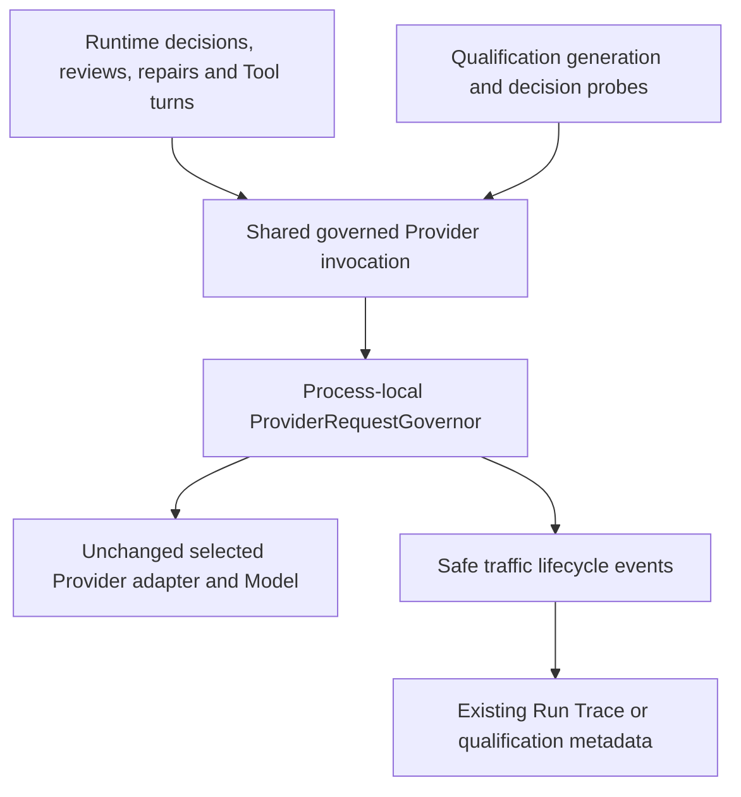

# Provider Traffic Control — verification report

**Status: COMPLETE — 2026-10-07.** Implementation, full automated checks, rebuilt Docker, actual browser qualification and six real runtime Runs verified. Gemini qualification is deliberately partial after genuine transient/quota conditions, as permitted by the requested stop-on-real-condition acceptance. This is not a claim that every Gemini model is qualified.

## A. Pre-change state

- Studio HEAD: `6fd567422194fee4481a7bfbd8d94dd43e373e49`.
- Core HEAD: `a1315a4f3d9498005522fd233c4e4cd6f849b0d7`.
- Both checkouts already had substantial uncommitted compatibility/runtime work. Preserved it; initial tracked patches are `/tmp/traffic-studio-initial.diff` and `/tmp/traffic-core-initial.diff`. No reset, clean, stash, checkout, commit, push or publication.
- Read existing compatibility/runtime/qualification reports and audited current adapters, decisions, ToolSession, qualification claims, cancellation, Runs, SSE and persistence before implementation.
- Actual runtime: Docker Desktop `desktop-linux`, backend Python 3.12 at port 8000, frontend at 5173, original PostgreSQL. Core is installed from the local Compose additional build context at `/usr/local/lib/python3.12/site-packages/agenttree`.
- [Initial resource fingerprints](checks/initial-inventory.json); migration `0014_resource_history`, already head. No migration added.

## B. Historical Groq forensics

Retained Run `0e728228-9535-4127-bdb3-79a28c757413`: failed with `PROVIDER_RATE_LIMIT`, **11091 ms**, **125 persisted events**. First retained rate-limit evidence is a normalized runtime failure, not a raw response. Trace contains 34 prepared/in-flight journal operations, six decision attempts and one bounded repair. Nested journal operations are **not** 34 distinct HTTP calls.

**Original quota unit/window/scope: NOT PROVABLE.** Raw quota response, Retry-After and limit headers were not retained. Neither TPM nor RPM can be asserted retroactively. A low daily count cannot rule out minute-level request/token limits, concurrency, model/project quota or capacity. Independent calls lacked shared admission/cooldown coordination; this architectural gap is fixed, without pretending it proves a specific historical quota dimension.

Also retained failed Run `ecb0407a-a3b4-4999-af7c-6845241cb8fb`; its old coarse failure cannot be reclassified without missing evidence. [Historical export](checks/forensics.jsonl).

## C. Gemini forensics

Before: Connected, with 15 interrupted attempts containing model quota exhausted, model rate limited or provider unavailable classifications. Prior code already parsed some numeric-429 RetryInfo/QuotaFailure; metadata was not wholly absent. Untyped RESOURCE_EXHAUSTED, chained transport failures, header intelligence and coordinated retry had gaps. Historic unavailable errors cannot all be declared quota.

Actual new qualification: `models/gemini-3.7-flash` had two capacity failures, each followed by bounded wait and a successful resumed dispatch, then **HTTP 429** during Manager decomposition. Structured evidence identified **requests_per_minute**, **model** scope, **5.0 s RetryInfo**. No numeric quota limit, remaining quota or request ID was invented. [Safe persisted evidence](checks/gemini-qualification.json).

Gemini remained Connected. Scan proceeded beyond this model-specific failure; `models/gemini-flash-latest` later retained `verification_timeout`. Final pause banner truthfully says timeout, not disconnected or quota. Stop qualification was clicked after obtaining quota evidence; the active request ultimately finished with timeout. A real in-flight `verification_stopped` outcome was **not** observed or claimed.

## D. Architecture

Before: independent adapter calls plus layered qualification retries. After: runtime converges at `tools.runtime._provider_response`; Studio generation construction and injected Ollama generation probe use the same decorator/governor. Already governed Providers are not wrapped twice. Redundant qualification transport retry is skipped for governed failures.

Routing, review/revision bounds, Fast/Deep, compatibility and readiness semantics remain unchanged. No Agent-specific sleep, fallback, new runtime endpoint, worker engine, Redis or distributed locks.

## E. Failure model

`ProviderFailure`: category, retryable, actual HTTP status when available, optional RateLimitSignal and transport stage. Compact categories: rate_limit, quota_exhausted, capacity, network, timeout, authentication, invalid_request, model_unavailable, malformed_response, cancelled, unknown. DNS/TLS/proxy/connect are network stages. Existing authentication exceptions encompass authentication/authorization; existing unavailable exceptions encompass capacity/server unavailability, with HTTP status retaining the distinction when supplied.

Classification uses typed SDK/status/structured evidence and safe chained causes. Raw exception bodies/text are not traffic diagnostics. Authentication, invalid/schema/semantic failures do not automatically quota-retry.

## F. Rate-limit model and keying

`RateLimitSignal`: known kind/scope, retry_after, quota_exhausted, safe request ID, HTTP status and numeric limit/remaining/reset observations. Missing or ambiguous values stay unknown. Mixed dimensions cannot become falsely precise scope.

Gemini model dimensions select model cooldown; explicit project-only dimensions select broader cooldown. Unknown signals coordinate conservatively across the credential but diagnostic scope remains **unknown**. Studio privately fingerprints family + endpoint + credential identity; no credential/fingerprint is emitted. Base admission is shared across models with model-child cooldown. Standalone Core defaults to Provider type/name when no host key is supplied; hosts requiring credential coordination must supply a shared key.

## G. Provider extraction

| Path | Available evidence |
| --- | --- |
| Groq, Cerebras, OpenRouter, custom compatible | Allowlisted Retry-After, request IDs, x-ratelimit limit/remaining/reset request/token headers, explicit quota units, actual final usage |
| Gemini SDK | Numeric 429/RESOURCE_EXHAUSTED, RetryInfo string or seconds/nanos, QuotaFailure dimensions, typed capacity/timeout/transport errors, actual usage |
| OpenAI SDK | Shared normalization/governance; automatic SDK retries disabled for newly constructed clients |
| Ollama | Governed runtime and qualification HTTP probe; no quota invented for local requests |

Reset parser accepts finite seconds, HTTP date, vendor h/m/s/ms durations. Gemini newly constructed clients use one SDK attempt. Injected clients and existing bounded optional-feature negotiation remain compatible. Other adapters were covered automatically, not falsely claimed as live credential acceptance.

## H. Governor

- Shared process instance: **two active requests per credential scope**, queue **256**, scope cache **1024**. Only idle expired entries without queued work/live budget are evicted.
- FIFO among eligible same-scope tickets. Model-cooled head can be bypassed by another eligible model; unrelated credential scope remains independent. Runtime/qualification use the same fairness policy, no separate priority.
- Reliable remaining/reset headers permit proactive request/token admission. Reserve declared output bound or explicit host total estimate; reconcile actual usage. Unknown input tokenization is not treated as measured quota. Out-of-order budget observations combine conservatively until reset.
- Reactive 429 honors Retry-After/reset, never shortens long vendor cooldown. Otherwise bounded exponential backoff+jitter. **Two retries / three dispatch attempts** maximum. Daily exhaustion does not automatically retry.
- Total admission wait: runtime **45 s**, qualification **5 s**. Active HTTP time is separate; existing total Run deadline still applies. Long cooldown defers with safe persisted retry information rather than holding a Run for hours.
- Condition waits, bounded checks and ticket cleanup; no busy loop. Queued cancellation prevents subsequent dispatch. SDK calls already in progress cannot be forcibly interrupted; actual usage is accounted before cooperative cancellation on return.
- Stream slot retained until iterator close/finalization; never replay after visible output. Rate-limit retry possible before output; general streaming failures are not automatically replayed. No Provider/model fallback.

## I. Qualification

Existing atomic claims, completed probes, Pending/transient state, retry_at and fresh successful results remain source of truth. Generation, routing/review decisions and repair use governance. Model scope need not stop the whole catalog; broad/unknown limits pause conservatively. Untested work stays Pending; proof survives transient failure.

Small existing-permission start/stop endpoints (`/api/providers/{id}/qualification/start`, `/stop`) plus Stop qualification button. Controls are cooperative, bounded, process-local; no migration/worker subsystem.

All **15** previously qualified/limited models across Providers retained exact successful status/evidence, including all five Gemini proofs. [Comparison](checks/fresh-results-preservation.json). Actual Discover/Verify checked remaining work and added `models/gemini-3.6-flash` proof rather than restarting successful models. Tests verify queued stop, restart/resume, partial progress and long cooldown. Remaining Gemini work was not repeatedly hammered.

## J. Trace/UI

Real lifecycle: `provider.request.queued/dispatched/completed/failed`, `provider.wait.started/resumed/deferred`, `provider.rate_limited`, `provider.retry.scheduled`, `provider.usage.reconciled`.

Runtime uses durable OperationJournal and existing Run ingestion. Random safe traffic_request_id correlates each logical invocation across retries with Agent ID, model, strategy and workload. Qualification stores at most 64 safe lifecycle records per attempt.

Playground includes real traffic and distinguishes waiting/failure; request-specific tracking prevents another concurrent completion from clearing a waiting request. Terminal Runs have no false waiting banner. Trace explains traffic and retains existing one-time semantic repair evidence. Provider connection is separate from qualification. EN/TH and current Light/Dark design preserved.

No synthetic waiting screenshot: runtime acceptance had no natural quota wait. Waiting/resume UI covered by behavior tests; actual Gemini qualification metadata contains capacity wait/resume.

## K. Tests

Full-suite scope and reproduction commands; canonical logs in checks/.

| Check | Command / environment | Result |
| --- | --- | --- |
| Core | Local Core checkout, local src PYTHONPATH, Python `-m pytest tests -q -p no:cacheprovider`, bytecode writes disabled | **841 passed, 5 skipped**, 38.91 s; credential-gated SDK tests skipped |
| Backend | Studio `.venv/bin/python -m pytest tests -q -p no:cacheprovider`, local Core PYTHONPATH, bytecode writes disabled | **421 passed**, 64.74 s; one existing Starlette cookie deprecation warning |
| Frontend | `npm test`, frontend directory | **367 passed**, 54 files |
| TypeScript | `npx tsc -b` | PASS |
| Production | `npm run build` | PASS; existing large-chunk advisory |
| Whitespace | `git diff --check`, both repositories | PASS |

[Core](checks/core-tests.log), [backend](checks/backend-tests.log), [frontend](checks/frontend-tests.log), [TypeScript](checks/typescript.log), [build](checks/build.log).

New behavior tests: same-scope concurrency/FIFO/independent scope, queue bounds, budgets/usage, long/reset cooldown, cancellation without dispatch, active-time/wait separation, bounded retry, stream close/no replay, safe typed failure/unknown scope/RESOURCE_EXHAUSTED, qualification stop/resume/Pending/shared identity, concurrent UI waiting and localized Trace. Existing suites retained.

## L. Real Provider acceptance

Actual authenticated browser Runs, existing credentials, synthetic non-sensitive input. No credential changes.

| Provider/model | Result | Governed calls | Actual token totals |
| --- | --- | ---: | --- |
| Groq qwen/qwen3.8-27b | Fast Completed, 42 | 2 (one existing bounded decision repair) | 266, 367 |
| Gemini models/gemini-3.1-flash-lite | Fast Completed, 42 | 1 | 254 |
| Cerebras qwen-3.8-27b | Two close Fast Completed, 42; Deep Completed | 2 / 1 / 7 | Per-call usage archived |
| Ollama phi4-mini:latest | Fast Completed, 42 | 1 | Unknown, reported_usage=false |

Ollama's existing Core adapter labels family custom; saved Studio binding proves actual Ollama/model. No fabricated token count/cloud quota.

## M. Runs, persisted Trace and reload

| Mode/Provider | Run ID | Duration ms | Full Trace | Core durable stream |
| --- | --- | ---: | ---: | ---: |
| Fast/Groq | 1c3e907f-336a-49f1-937c-0b09db997d9e | 913 | **41** | 32 |
| Fast/Gemini | 0b5182cf-26a9-40d4-a321-23f292181c77 | 16166 | **30** | 21 |
| Fast/Cerebras A | f4d5f26e-d2ed-4f02-bc3a-12f6ab9d1977 | 1707 | **41** | 32 |
| Fast/Cerebras B | 2208d57c-9dee-4f18-93c6-05ed694a1c06 | 869 | **30** | 21 |
| Fast/Ollama | 9556dc6a-4f53-41f3-a251-c08b2685f20d | 8080 | **30** | 21 |
| Deep/Cerebras | e61ef90d-96d6-4469-a5e0-4032ebfa237e | 6170 | **122** | 91 |

Full Trace includes existing Studio synthesized rows without core_sequence; Playground/V2 stream counts only Core-sequenced events. This existing distinction explains counts, not event loss. [Bindings, hashes, events and actual usage](checks/real-runs.json).

Groq/Gemini/Ollama/Deep reloaded using real run IDs and restored result/status/timeline. Groq and Deep Open Execution Trace opened matching persisted Run/result. All six completed, no fallback. Groq/Cerebras Fast A performed visible existing one-time contract repair, separately governed and retained.

Deep: Root planning → capability triage → Manager decomposition → Specialist → Manager Review → Root Final Review → synthesis. Seven actual calls, Manager passed, final review pass, result available. No fabricated graph sequence.

Two Cerebras Fast Runs from two real tabs used the same Tree/credential; first dispatches **09:50:19.727142Z** and **09:50:19.799663Z**, **72.521 ms apart**. Both overlapped, completed and recorded independent request IDs/usage through the shared boundary. No quota rejection forced; tests verify queuing beyond configured concurrency.

## N. Real Gemini qualification

- Actual browser Test Connection succeeded, gemini connected successfully; remained Connected after workload failure.
- **62** catalog rows, **45** generation candidates.
- Checked **19/45**; Ready **6**, Limited **0**, Unavailable **30** catalog-wide (13 candidates, 17 other rows), Pending **26** candidates.
- Before Ready 5/Unavailable 27/Pending 30; one added Ready, three incompatible-response results, Pending reduced by four. No successful proof erased.
- Actual RPM/model/5 s signal persisted. Actual capacity waits approximately 2.2 s twice and resumed dispatches before 429. Qualification's total wait bound prevented immediate further quota attempts after prior waits consumed its budget.
- Scan continued to other models; final flash-latest timeout stayed Pending and produced truthful timeout pause.
- Stop clicked; progress survived subsequent service/frontend restart and reload. Fresh evidence reuse verified by hashes. Full remaining-catalog completion not claimed; deterministic resume/long cooldown coverage avoids damaging quota.

## O. Docker/source/logs

Rebuilt affected backend/frontend from dirty local source, then `compose up -d --no-deps backend frontend`. Original active user Runs reached terminal states before recreation; none cancelled for the update. PostgreSQL never recreated/reset.

Final backend/frontend/PostgreSQL **healthy**. Original Postgres container **7748558f8924**, created 2026-10-06 05:24:16 +07, remained with original volume. Alembic current/head both **0014_resource_history (head)**.

[Final import path/hashes](checks/runtime-source.json) match all eight audited local Core boundary/adapter files after final rebuild. [Docker build](checks/docker-build.log). [Sanitized logs](checks/log-summary.json): 140 inspected backend/frontend lines, zero traceback/error markers. Configuration produced no individual HTTP access-log transactions; empty transaction summary is not proof of independently captured status for every request.

## P. Browser

Authenticated Chromium in-app browser, actual localhost Docker stack. Providers, Playground and persisted Trace verified EN/TH, Light/Dark. Completed graph and real model bindings readable; Thai explains traffic naturally with technical terms retained. No theme redesign.

All five verification tabs: **zero console warning/error entries**, [captured console](checks/browser-console.json). Real submit/Run ID/timeline/result/Trace/reload verified. Raw HAR/network interception unavailable; available visible transactions, persisted events/results, source freshness and application logs inspected instead, as permitted.

[16 real screenshots](screenshots.md). No fabricated quota state. Temporary extra tabs closed; session returned to original Providers in Light/English.

## Q. Data/cleanup

[Comparison](checks/preservation-summary.json), [final inventory](checks/final-inventory.json), [cleanup](checks/cleanup.jsonl).

**No original row missing in any audited table.** Four Providers, three Secrets, four Tool connections including existing MCP representations, seven API tokens, three users, seven Trees and initial Runs/Trace/Artifacts/qualification rows retained. Secret/token/user/Tool fingerprints unchanged; all 15 successful proofs exactly retained.

Expected changes: Gemini check/catalog timestamps and six qualification attempts, no credential replacement. During the long audit, original Tree d5867d72-fc36-4535-ac4e-a5419cbfbee9 acquired four versions and two original user Runs. Original Agent/version rows retained unchanged. These concurrent existing-session changes are recorded, not undone or attributed to disposable verification. Initial active Run 0af8a9d1-b919-4456-a883-8c80e421eafb reached its own terminal state. Final original totals: 28 Runs, 26 versions; preserving data does not freeze legitimate concurrent work.

Both historical failed Run row fingerprints unchanged. Only four task-created Trees and their six completed Runs deleted after evidence export with ID/name/terminal guards:

- 2be84f1d-a33f-4804-9202-b24173973750
- 6a79e817-79f2-4452-93d5-f48f75fbd021
- 72e92d4d-da95-4f95-9c62-6f49c1bf49c3
- c8c703ad-fea5-40a2-80f8-720d2b5ae481

Archived acceptance Run IDs are evidence, not navigable retained Runs after cleanup. No original resource or qualification history deleted.

## R. Security

Traffic diagnostics contain structural categories, finite numeric facts, safe IDs, selected model/family, strategy/workload/Actor ID. No raw body/prompt/hidden reasoning/authorization/cookie/secret header/private credential fingerprint. Headers allowlisted; existing persistence sanitizer still applies.

Recursive forbidden-key checks on six Runs/events: **0** populated forbidden credential/reasoning keys. Tests cover unsafe IDs/headers. Inventory uses one-way fingerprints, not Secret plaintext or encrypted material. Reports/screenshots contain no credentials.

## S. Git/files

HEADs unchanged; dirty work intentionally retained. Core changes explicitly authorized for this mission. No commit, push or publication.

Incremental changes:

- Core new providers/traffic.py, providers/traffic_failure.py, tests/test_provider_traffic.py.
- Core tools/runtime.py; providers/exceptions.py, compatible.py, gemini.py, openai.py, exports; focused adapter/scope tests.
- Studio backend/providers/generation.py; services/model_discovery_service.py, model_qualification.py, provider_service.py, new qualification_control.py; api/providers.py.
- Studio new tests/test_provider_traffic_integration.py, focused provider-management assertions.
- Frontend lib/api.ts, playground-execution.ts, trace-activity.ts; pages/providers.tsx, trees/tree-playground.tsx; EN/TH translations and focused tests.
- This verification directory. Existing unrelated dirty files preserved; no migration, dependency or design-system rewrite.

## T. Limitations

1. Process-local governor/control; current single serving backend process only. No distributed guarantee across workers/containers or project relationships absent from vendor metadata.
2. Unknown quotas stay unknown. Input tokenization is not exact; available output/host estimates and reported usage do not guarantee exact TPM prevention.
3. Historical Groq quota type cannot be reconstructed. Runtime Runs had no natural 429; deterministic tests cover quota cooldown/resume/queued cancellation; real Gemini showed capacity wait/resume and 429.
4. In-flight SDK cannot be forcibly cancelled. General streaming failures after output are not replayed; existing opaque optional-feature negotiation is not independently scheduled per internal wire request.
5. Remaining 26 Gemini candidates Pending. Real timeout/quota ended this controlled scan; requested stop-on-real-condition acceptance passed, not universal model compatibility/full completion.
6. Raw HAR unavailable; access logs lacked individual HTTP statuses. Console, real lifecycle/result correlation and safe application logs inspected.
7. Existing chunk advisory/deprecation warning, Ollama generic family/unknown usage and Playground/full-Trace count distinction documented, not redesigned.

Next operational check: resume existing remaining qualification after recorded retry_at, then observe normal multi-Agent traffic without quota flooding. Add external coordination only if deployment later introduces independent backend workers.
